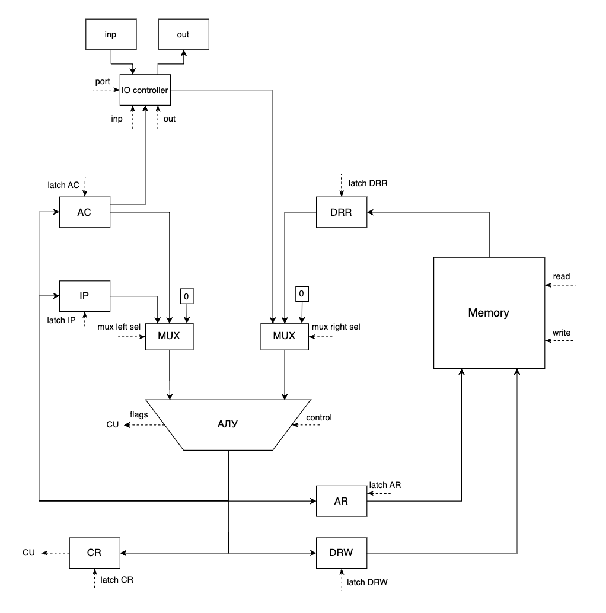
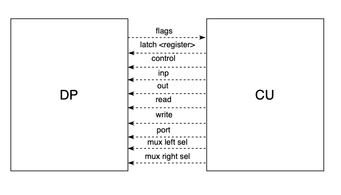

# csa-lab3

- Зыков Дмитрий Андреевич. Группа P3218
- Вариант: `asm | acc | neum | hw | instr | struct | stream | port | cstr | prob2 | cache`
- С упрощением

## Язык программирования

### Синтаксис

``` enbf
<program> ::=
    ".data" <newline> {<data>} <newline>
    ".text" <newline> {<instruction>} <newline> 
    
<data> ::= <label> ": " <value> <newline>
<instruction> ::= <address_command> <label> <newline> | <address_command> "$"<number> <newline> |
                 <adress_command> "@"<label> <newline> | <adress_command> "#"<label> <newline> |
                 <no_adress_command> <newline> 


<no_adress_command> ::= "inc" | "dec" | "not" | "neg" | "hlt"| "inpp" | "outt"
<adress_command> ::= "add" | "sub" | "and" | "or" | "ld" | "st" | "cmp" | "mod" | "jmp" | "jz" | "lea" 

<value> ::= <number> | "'"<word>"'" 
<label> ::= <word> 
<data> ::= <label> ": " <value> <newline>
<newline> ::= "\n"
<word> ::= <letter> {<letter>}
<number> ::= "-?[0-9]+"
<letter> ::= "[a-zA-Z]+"
```

### Пояснение

### Семантика

- Видимость данных -- глобальная.
- Код выполняется последовательно.
- Поддерживаются строковые литералы, символы строки необходимо заключить в кавычки.
- Поддерживаются целочисленные литералы, находящиеся в диапазоне от $-2^{31}$ до $2^{31}-1$
- Программа обязательно должна включать секцию `.text:`, указывающую на 1-ю выполняемую интсрукцию. Эта метка не может
  указывать на константу.
- Переменные могут быть объявлены только в секции `.data`. Инструкций в ней быть не должно.
- Секции должны быть разделены пустой строкой.
- Название метки не должно совпадать с названием команды и не может начинаться с цифры.
- Метки находятся на одной строке с командами, операнды находятся на одной строке с командами.
- Переменные и метки не могут повторяться.
- Числа быть записаны в десятичной системе счисления.

### Пример

Пример программы, вычисляющей сумму двух чисел:
```asm
.data
A: 2
C: 0

.text
ld A
add $3
st C
hlt
```

### Режимы адрессации

- Непосредственная (immediate) - операнд содержится в аргументе инструкции. 
- Прямая (direct) - операнд содержится по адресу указанной ячейки
- Косвенная (indirect) - операнд содержится по адресу, который содержится в ячейке, адрес который был указан

### Организация памти

- Память команд и данныx -- общая.
- Размер машинного слова -- `32` бит.
- Память содержит `2^10` ячеек.
- Литералы в статической памяти располагаются в порядке их записи в коде.

- Регистры:
- - Аккумулятор (AC) -- хранит результаты вычислений.
- - Регистр адреса (AR) -- хранит адрес ячейки памяти.
- - Счетчик инструкций (IP) -- хранит адрес следующей инструкции.
- - Регистр чтение данных (DRR) -- хранит данные, считанные из памяти.
- - Регистр записи данных (DRW) -- хранит данные для записи в память.
- Флаги
- - N - флаг отрицательности
- - Z - флаг нуля

## Система команд

С аргументом:

- add <arg> - добавить к AC arg
- sub <arg> - вычесть из AC arg
- and <arg> - побитовое И AC с arg
- or <arg> - побитовое ИЛИ AC с arg
- ld <arg> - записать из arg в AC
- st <arg> - записать из аккумулятора в arg
- cmp <arg> - проставить флаги NZ как при операции AC - arg
- lea <arg> - записать адрес arg в ac

Без аргументов:

- hlt - завершение программы
- not - логическое НЕ к аккумулятору, 0 -> 1 или !0 -> 0
- neg - изменить знак аккумулятора, N = !N
- in - ввод данных в АС
- out - вывод данных из АС
- inc - инкрементировать АС
- dec - декрементировать АС


Переход:

- jmp <arg> - безусловный переход к arg
- jz <arg> - если Z = 1, переход к arg
- jn <arg> - eсли N = 1, переход к arg

## Кодирование команд


- Машинный код сериализуется в список JSON.
- Один элемент списка -- одна инструкция.
- Индекс списка -- адрес инструкции. Используется для команд перехода.

```json
[
    {
        "index": 14, 
        "is_instruction": true, 
        "instruction": 
        {
            "opcode": "ST", 
            "operand": 12, 
            "addressing_mode": "DIRECT"
        },
        "data": 0
    }
]
```

где:

- `index` -- ячейка памяти
- `is_instruction` -- определяет данные или инструкция
- `instruction` -- инструкция (если не данные)
- `data` -- данные (если не инструкция)
- `opcode` -- строка с кодом операции
- `operand` -- аргумент (может отсутствовать)
- `addressing_mode` -- информация о используемом виде адресации

## Транслятор

Интерфейс командной строки: `translator.py <source_file> <target_file>`

Правила трансляции:
 - Одна команда - одна строка. 
 - Метки пишутся на одной строке с командой/данными.
 - Названия секций пишутся в отдельной строке. 
 - Ссылаться можно только на существующие переменные и метки.
 - Секции должны разделяться пустой строкой
 - Обязательно существование секции `.text`

## Модель процессора

Интерфейс командной строки: `machine.py <code_file> <input_file>`

### DataPath

Класс `data_path` реализует управление памятью и регистрами процессора.

### ControlUnit

Класс `control_unit` реализует управление процессором.

Сигналы:
- `latch <register>` -- защёлкнуть выбранное значение в регистр <register>
- `read` -- считать данные из mem[AR] в DRR
- `write` -- записать данные из регистра DRW в mem[AR]
- `mux sel` -- сигнал для выбора входа мультиплексора
- `inp` -- значение из входного буфера записать в аккумулятор
- `output` -- записать аккумулятор в порт вывода 

## Тестирование
 - Тестирование осуществляется при помощи golden test-ов.
 
Golden тесты:
* [hello](./src/csa_lab3/golden/hello.yml)
* [cat](./src/csa_lab3/golden/cat.yml)
* [hello user](./src/csa_lab3/golden/hello_usr.yml)
* [prob2](./src/csa_lab3/golden/prob2.yml)


```text
| ФИО                      | алг   | LoC |instr |code instr| 
| Зыков Дмитрий Андреевич  | hello | 17  | 17   | 101      |asm|acc|neum|hw|instr|struct|stream|port|cstr|prob2|cache    
| Зыков Дмитрий Андреевич  | cat   | 4   | 7    | 39       |asm|acc|neum|hw|instr|struct|stream|port|cstr|prob2|cache    
| Зыков Дмитрий Андреевич  | prob2 | 15  | 30   | 574      |asm|acc|neum|hw|instr|struct|stream|port|cstr|prob2|cache
```


